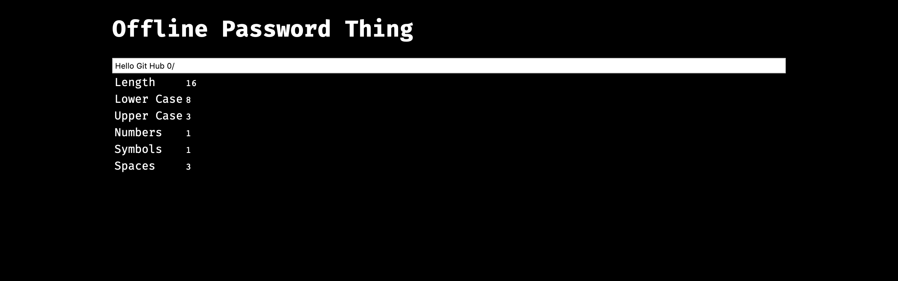

# password-destructure
Password managers generate nice passwords but sometimes websites have stupid requirments.

You had to sign up for some website

It asked for a password

Your password manager spit out something you're happy with

But the site won't accept it because...

```
[
	Too Many Characters (grrrr)
	Not Enough Upper case
	Not Enough Numbers
	Not Enough Symbols
	Use of Wrong Symbols
	Spaces Not Allowed (grrrrrrrrr)
]
```

So you go to edit the password

And this is just to make it so you're not opening python and doing 
```py
len("<your password here>")
```


it looks bad because I don't have time to make it look good

Styling PR's Welcome

No NPM